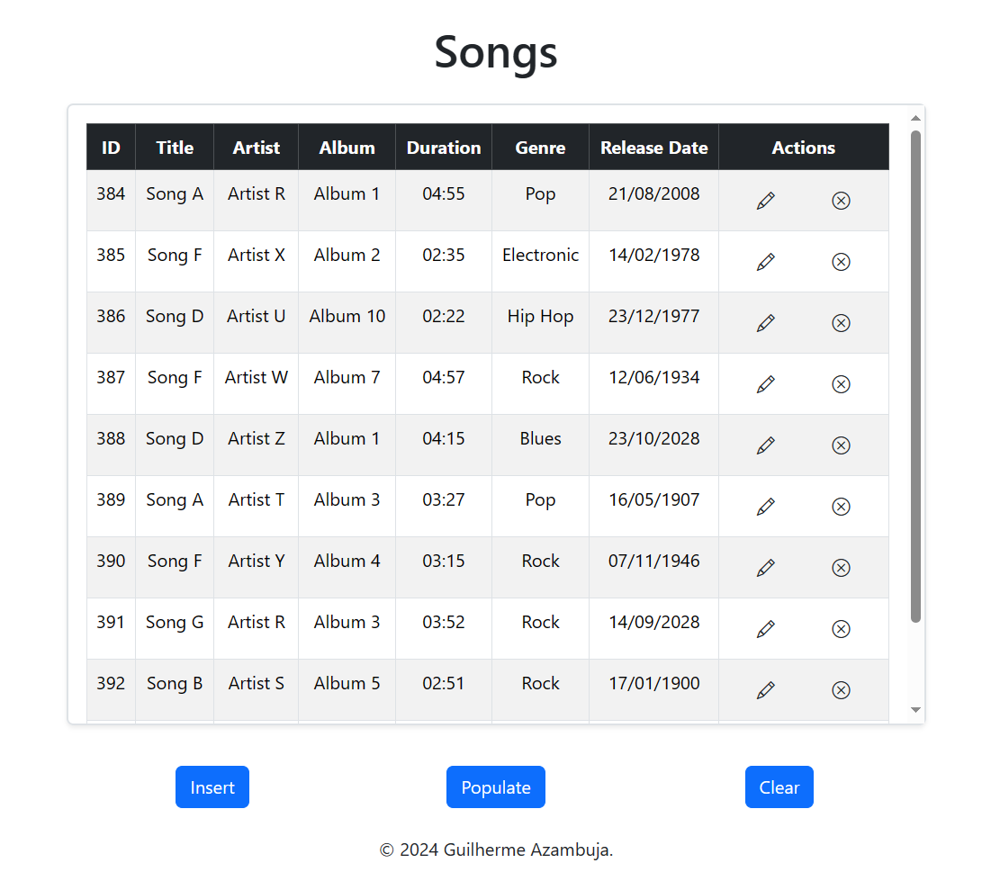

# Flask CRUD Application

A Flask CRUD application designed for managing songs in a PostgreSQL database

<div style="text-align: center; margin-top: 10px; margin-bottom: 10px;">
    <p>
        
    </p>
</div>

## Introduction

This Flask CRUD (Create, Read, Update, Delete) application enables users to manage a list of songs, providing essential
functionalities such as inserting, updating, and removing songs from a database. Additionally, the application allows
users to populate the database with sample data and clear the entire table.

## Run

To run the Flask CRUD application, follow these steps:

### 1. Install Dependencies

Install the required Python packages listed in requirements.txt using the following command:

```bash
pip install -r requirements.txt
```

### 2. Run the Application

Execute main.py to start the Flask application. You can do this by running the following command:

```bash
python main.py
```

### 3. Access the Application

Open your web browser and navigate to http://127.0.0.1:5000/ to access the application.

Feel free to explore, insert, edit, and remove songs from the database.

## Technologies Used

- Flask (Web Framework)
- SQLAlchemy (Database Operations)
- Bootstrap (Styling)
- Bootstrap Icons (Icons)